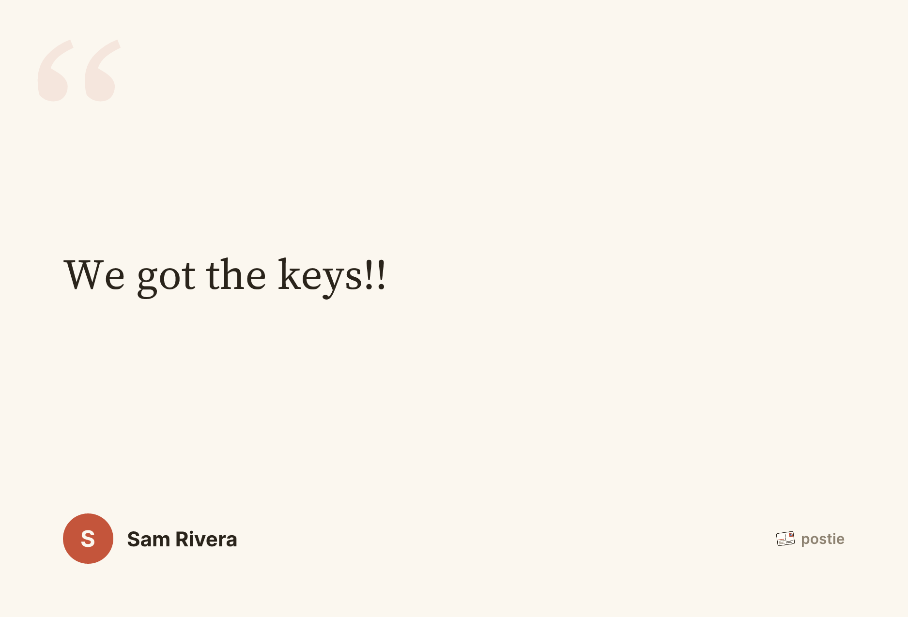
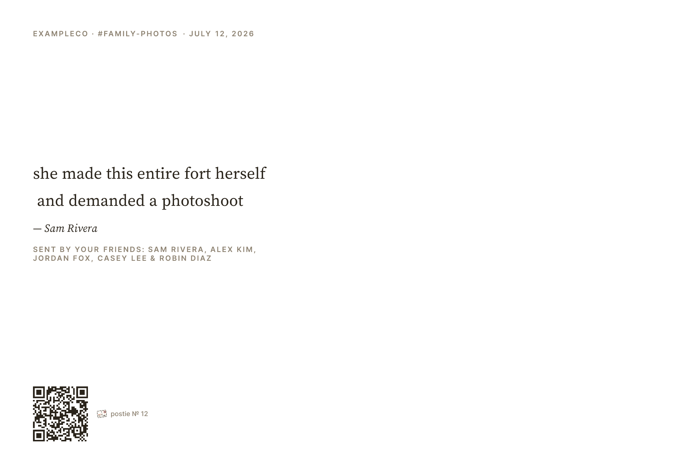

# Postie 📮

A Slack app that turns beloved messages into real, mailed postcards. React to a
message with :postcard: — when it collects enough reactions (default 5), Postie
renders it into a print-ready card, mails it via
[Mailstream](https://mailstream.app), and posts the design back into the thread,
followed by delivery-status updates.

Each workspace brings its own Mailstream API key (`/postie setup`), so Postie
never touches the money. All cards go to the workspace's configured address
(`/postie address`).

## The cards

<p>
  
  
</p>
<p>
  
</p>

## How it works

```
Slack ──▶ API Gateway ──▶ receiver Lambda (Bolt: verify, ack <3s, enqueue)
                                │
                                ▼ SQS (retries ×3 → DLQ → alarm → email)
        EventBridge (4h) ──▶ worker Lambda
        "track_all"          ├─ send: reactions.get → threshold?
                             │   → DynamoDB conditional write (exactly-once)
                             │   → normalize (blocks → segments, names resolved)
                             │   → render (satori + resvg-wasm + jimp, no native deps)
                             │   → S3 artwork (public capability URLs)
                             │   → Mailstream createPostcard (idempotent)
                             │   → front/back preview into the thread
                             └─ track_all: poll card status → thread updates
```

**Card grammar — front is the moment, back is the information:**
- Photo messages: wide images run full-bleed; square/portrait get a blur-fill
  backdrop (the image itself, blurred, behind the sharp uncropped original).
  No text on photo fronts.
- Text messages: the typography is the front — Source Serif on warm paper,
  with the author.
- The back carries the message (for photo cards), attribution, everyone who
  reacted ("Sent by your friends: …"), workspace · channel · date, a card
  number, and a QR code back to the Slack thread — with the right 60% left
  clear for the address, postage, and USPS barcode.
- Mentions, links, bold/italic/code, code blocks, custom workspace emoji, and
  unicode emoji (twemoji) all render. Bot posts are attributed to the human
  they were posted for when the bot credits one in its context block.

## Repo layout

```
src/core/       types, DynamoDB single-table store (+ MemoryStore for tests),
                SQS queue, KMS crypto, SSM secrets, S3 artwork store
src/slack/      reaction listener, /postie command router, modals, auto-join
src/postcard/   blocks/mrkdwn → normalize → render → send pipeline → tracker
src/mailstream/ client interface: stub + verified HTTP client
src/lambda/     receiver / worker entries
infra/          CDK stack (DynamoDB, KMS, SQS+DLQ+alarm, 2 Lambdas, HTTP API,
                optional custom domain, tracking tick)
assets/         Inter + Source Serif 4 statics, the Postie mark, app icon
```

## Setup

### 1. Deploy AWS

Bring your own AWS account. Personal values live in the **gitignored**
`infra/cdk.context.json` — create it with your custom domain (optional; omit both
keys to use the raw API Gateway URL) and alert email:

```json
{ "domain": "postie.example.com", "hostedZone": "example.com", "alertEmail": "you@example.com" }
```

The domain's Route53 hosted zone must already exist in the account; the stack
creates the ACM cert + DNS record. Then:

```sh
npm install
export AWS_PROFILE=your-profile
npx cdk bootstrap    # once per account/region
npm run deploy       # outputs SlackRequestUrl
# After the Slack app exists (next step), store its secrets:
aws ssm put-parameter --overwrite --region us-east-1 \
  --name /postie/slack/bot-token --type SecureString --value xoxb-...
aws ssm put-parameter --overwrite --region us-east-1 \
  --name /postie/slack/signing-secret --type SecureString --value ...
```

Lambdas cache SSM values per instance — after rotating the parameters, wait
out the idle recycle or nudge the functions (any redeploy works).

### 2. Create the Slack app

1. [api.slack.com/apps](https://api.slack.com/apps) → *Create New App* → *From
   a manifest* → paste `config/slack-manifest.json` with `YOUR-POSTIE-DOMAIN` swapped for
   the deployed `SlackRequestUrl` host.
2. Install to the workspace; put the **bot token** and **signing secret** into
   the SSM parameters above (they're read at Lambda cold start).
3. Upload `assets/postcard-emoji.png` as a custom `:postcard:` emoji (or
   `/postie emoji <name>` to use any other emoji).
4. `/postie join-all` — or keep presence invited-only per channel with
   `/postie here`.

### 3. Configure in Slack (admins)

- `/postie setup` — the workspace's Mailstream API key (stored KMS-encrypted)
- `/postie address` — where cards get mailed
- `/postie status` — configuration, today's count, all-time total
- `/postie threshold|cap|size|emoji|presence` — the knobs

Mailstream notes: cards cost print points (a 4×6 ≈ 0.9 points ≈ $0.90),
charged at creation — top up in their dashboard first. Cards batch to a
next-day send date and can be cancelled via their campaign until then.

### Iterating (no dev environment — by choice)

One Slack app, one deployment. `npm run deploy:fast` hot-swaps Lambda code in
seconds; card design iterates entirely offline: `npm run gallery` renders
every representative message shape (fronts + backs) to
`test/__output__/gallery/index.html`.

## Mailstream contract (verified live)

- Base URL `https://my.mailstream.app/api/v1`, `Authorization: Bearer <token>`.
- `POST /postcards`: `name`, `size` (`4x6|6x9|6x11`), `mail_type`
  (`first_class`), inline `to_address`, and `front_artwork`/`back_artwork` as
  **HTML strings capped at 100k chars** — so artwork ships as hosted image
  URLs, never inline data.
- `Idempotency-Key` must be a UUID; replay requires byte-identical payloads,
  which is why artwork S3 keys are deterministic per message.
- Response: `uuid`, `campaign_uuid` (singles are auto-wrapped in a campaign),
  `url` (signed proof PDF, ~7-day expiry, renders async ~20 min), `status`,
  `send_date`. Return address is account-level in Mailstream.
- No tracking webhooks exist — delivery updates come from Postie polling each
  open card's `status` every 4 hours.

## Engineering notes

- **Exactly-once mail.** Slack's `reaction_added` events carry no totals and
  arrive at-least-once; the worker treats them as hints, re-reads true counts,
  and wins the right to send via a DynamoDB conditional write. Failed sends
  release the lock so a fresh reaction retries.
- **Deterministic idempotency, end to end.** The message identity hashes into
  both the Mailstream `Idempotency-Key` (name-based UUID) and
  content-addressed S3 artwork keys — so a retry produces a byte-identical
  request and replays the cached response instead of double-mailing.
- **Zero native binaries.** The whole print pipeline is satori (flexbox → SVG),
  resvg-wasm, and jimp: Lambda bundles build identically from any host OS, no
  Docker required.
- **Renders what Slack renders.** Message text follows Block Kit's own
  editorial hierarchy (rich_text/section/header content over notification
  fallbacks, context-block "chrome" demoted), and bot posts are attributed to
  the human credited in their context block ("— sam · via bot") — no
  per-bot special cases.
- **Contract archaeology.** The mail vendor's API reference sits behind a
  login, so the client's field names, enums, and limits were recovered from
  live validation-error probing (guaranteed-422 payloads), then verified
  against a real production order.
- **Design iteration as a contact sheet.** `npm run gallery` renders ten
  representative message shapes — long text, emoji, code blocks, wide/square/
  portrait photos, bot posts — front and back into one HTML page.
- ES2024, strict TypeScript, NodeNext resolution, Biome, and a
  credential-free CI (typecheck, tests, lint, full CDK synth).

## Commands

```sh
npm run typecheck
npm run lint         # Biome (biome check --write to fix)
npm test             # unit tests; writes sample renders to test/__output__/
npm run gallery      # full design contact sheet
npm run deploy       # CloudFormation deploy (uses AWS_PROFILE)
npm run deploy:fast  # hotswap Lambda code only
```
